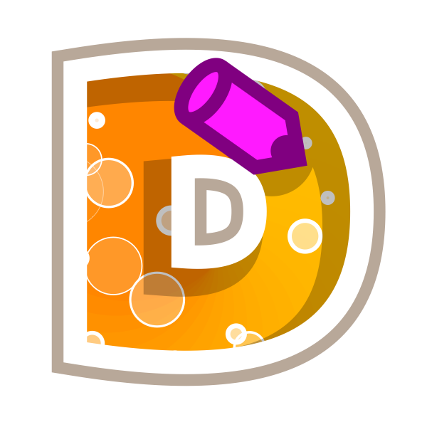
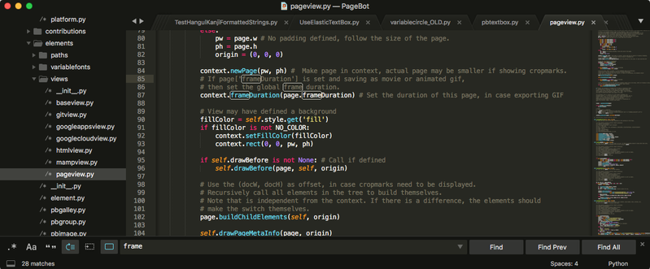

~~~
section = content.newSection()
box = section.newMain()
~~~
<a name="coding-in-python1"/>
## Basic coding in Python #1

### Design by parameters

#### Start August 24th 2020 • 2 weeks • €290

~~~
box = box.newInfo()
~~~

Take one of your designs and try to find the rules that are behind the composition. Learn to express that information in Python code. Then discover how the program can generate alternative versions of your original design, by the use of color themes, different page sizes and other parameters.

~~~
box = section.newCropped()
~~~

~~~
section = content.newSection()
box = section.newMain()
~~~
<a name="coding-in-python2"/>
## Basic coding in Python #2

### Functions, methods and classes

#### Start September 7th 2020 • 2 weeks • €290

~~~
box = box.newInfo()
~~~

After finishing [Basic coding in Python #1](#coding-in-python1), you have made a program that is doing one specific task. Great as that may be, it is hard to reuse that code for other projects. How nice would it be, to create a **“library”** with knowledge, that can be called for similar designs, without writing everything from scratch again?

~~~
box = section.newCropped()
~~~

